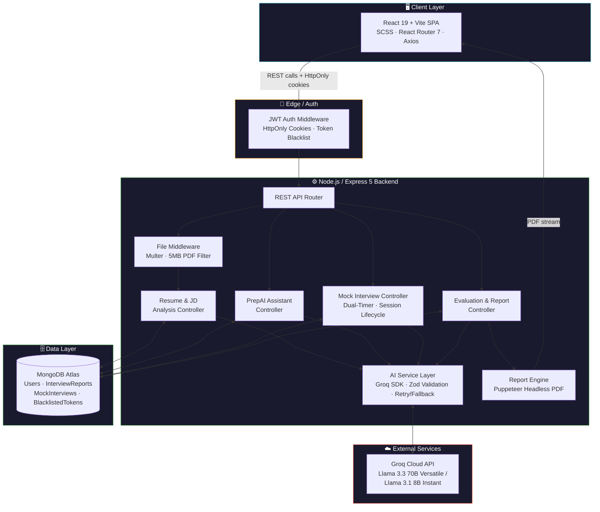
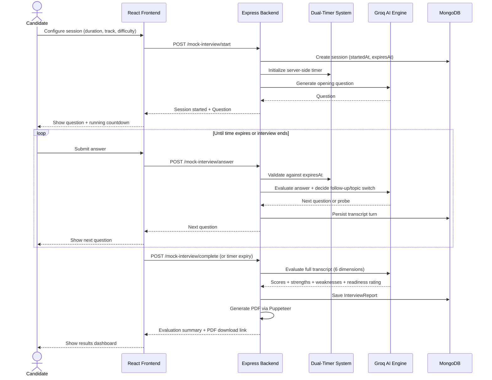
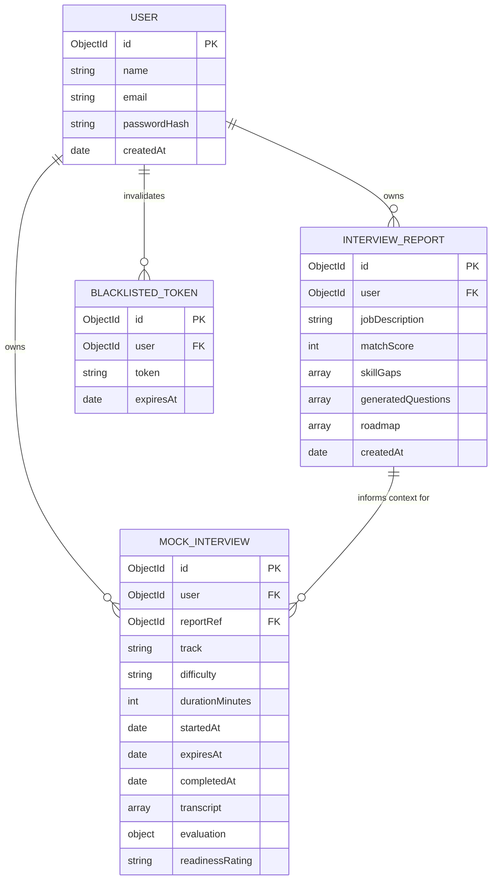

<div align="center">

#  PrepAI
### AI-Powered Interview Preparation Platform

[](https://react.dev/)
[](https://nodejs.org/)
[](https://www.mongodb.com/)
[](https://groq.com/)
[](#-license)

*From resume gap analysis to timed AI mock interviews with 6‑dimension scoring and downloadable PDF reports.*

</div>

---

##  Table of Contents

- [Overview](#-overview)
- [Key Features](#-key-features)
- [System Architecture](#️-system-architecture)
- [Mock Interview Flow](#-mock-interview-session-flow)
- [Data Model](#-data-model)
- [Tech Stack](#-tech-stack)
- [Getting Started](#-getting-started)
- [Environment Configuration](#️-environment-configuration)
- [Security Highlights](#-security--architecture-highlights)
- [Author](#-author)

---

##  Overview

**PrepAI** is a production-grade AI interview preparation platform that guides a candidate through the full prep lifecycle:

1. **Analyze** — upload a resume + target job description to surface skill gaps and a match score.
2. **Learn** — clear doubts with a context-aware AI mentor grounded in that specific report.
3. **Practice** — take a real-time, time-boxed AI mock interview with adaptive follow-ups.
4. **Improve** — receive a 6-dimension evaluation, a downloadable PDF report, and track growth over time.

---

##  Key Features

###  1. Resume & Job Description Analysis
- **PDF Resume Upload & Text Extraction** — parses resumes (up to 5MB PDF) and extracts skills, projects, and domain experience.
- **Match Score & Skill Gap Detection** — calculates a 0–100% match score and tags missing competencies by severity (`low`, `medium`, `high`).
- **Dynamic Question Generation** — generates targeted technical + behavioral questions with interviewer intent and model answers.
- **Personalized Preparation Roadmap** — a structured, day-by-day plan focused on closing detected gaps.

###  2. PrepAI Assistant (AI Doubt Solver)
- **Context-Aware Mentorship** — grounded in the candidate's active report (job description, match score, gaps, questions).
- **Interactive Technical Coaching** — explains system design trade-offs and gives coding / STAR-method examples.
- **Strict Domain Focus** — stays scoped to technical mastery, HR strategy, and prep rather than acting as a generic chatbot.

###  3. Full AI Mock Interview Agent
- **Flexible Configuration** — 10 / 20 / 30-minute sessions across Technical, HR-Behavioral, Mixed, or Job-specific tracks, at Easy / Medium / Hard / Adaptive difficulty.
- **Realistic Interviewer Simulation** — introduces the session, sets expectations, and asks one question at a time.
- **Adaptive Follow-Up Questioning** — probes incomplete answers or transitions topics naturally, without disruptive mid-session score cards.
- **Synchronized Dual-Timer System** — client-side countdown backed by strict server-side timestamp validation (`startedAt`, `expiresAt`, `completedAt`).

###  4. Post-Interview Evaluation & PDF Reports
Evaluates the full transcript across **6 core dimensions** (0–100):

| Dimension | What it measures |
|---|---|
| Technical Knowledge | Depth and accuracy of technical answers |
| Problem Solving & Critical Thinking | Approach to unfamiliar or hard questions |
| Communication Clarity | Structure and clarity of explanations |
| Answer Relevance | How directly answers address what was asked |
| Depth & Architectural Trade-offs | System-design maturity |
| Project & Practical Experience | Real-world grounding of examples |

- **Actionable Feedback** — executive assessment, strengths, weaknesses, reinforcement topics, next steps.
- **Interview Readiness Rating** — `Needs Significant Improvement` → `Developing` → `Almost Ready` → `Interview Ready`.
- **Downloadable PDF Reports** — branded reports via headless Puppeteer.
- **ATS Resume Generation** — clean, ATS-optimized resumes as PDFs.

### 📈 5. Interview History & Performance Comparison
- **Session Tracking** — every mock interview and resume analysis lives on a unified dashboard.
- **Growth Trends** — automatically computed performance trends across attempts.

---

## 🏗️ System Architecture



---

## 🎯 Mock Interview Session Flow



---

## 🗃️ Data Model



---

## 🧠 Tech Stack

| Layer | Technologies |
|---|---|
| **Frontend** | React 19, Vite, React Router 7, SCSS, Axios |
| **Backend** | Node.js, Express 5, MongoDB, Mongoose 9, JWT Auth, bcryptjs, Multer, Puppeteer, Zod |
| **AI Engine** | Groq Cloud API (`groq-sdk`) — `llama-3.3-70b-versatile` / `llama-3.1-8b-instant` |

---

##  Getting Started

### 1. Clone the repository
```bash
git clone https://github.com/pranjul075/ai-interview-preparation.git
cd ai-interview-preparation
```

### 2. Setup and run Backend
```bash
cd Backend
npm install
npm run dev
```
The server starts on `http://localhost:3000`.

### 3. Setup and run Frontend
```bash
cd ../Frontend
npm install
npm run dev
```
The client starts on `http://localhost:5173`.

---

## Environment Configuration

Create a `.env` file in the `Backend` directory (see `.env.example`):

```env
# MongoDB Connection URI
MONGO_URI=mongodb+srv://<username>:<password>@<cluster>.mongodb.net/prepai
MONGODB_URI=mongodb+srv://<username>:<password>@<cluster>.mongodb.net/prepai

# Server Port
PORT=3000

# JWT Authentication Secret
JWT_SECRET=your_super_secret_jwt_key_here

# Groq Cloud API Key (Get a free key at https://console.groq.com)
GROQ_API_KEY=gsk_your_groq_api_key_here

# Groq Model (Default: llama-3.3-70b-versatile)
GROQ_MODEL=llama-3.3-70b-versatile
```

For the `Frontend` (optional custom API URL):
```env
VITE_API_URL=http://localhost:3000
```

---

## 🔐 Security & Architecture Highlights

- **Ownership Enforcement** — every report, resume, mock interview session, and PDF download endpoint verifies `user === req.user.id`. Users cannot access private data by guessing IDs.
- **Hardened Cookies** — JWT tokens issued with `httpOnly: true`, `sameSite: "lax"`, and `secure` in production.
- **Fail-Safe AI Layer** — the Groq service uses strict Zod schema parsing, retry mechanisms for transient errors, and robust fallbacks so API rate limits or malformed responses never crash the Express server.
- **Database Optimization** — indexed queries on `user`, `createdAt`, plus a TTL index on token blacklists.

---
